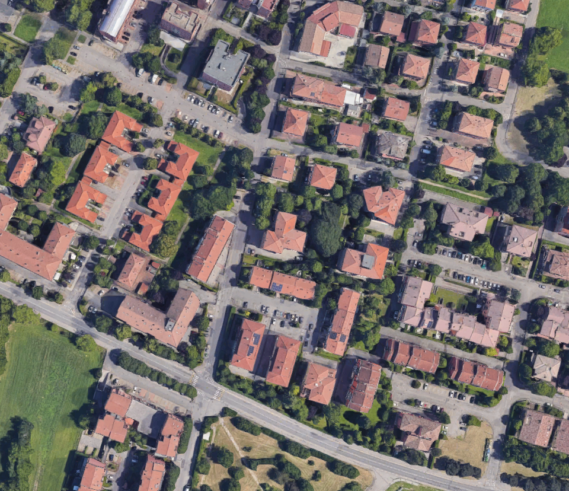
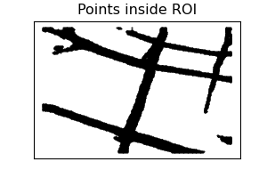
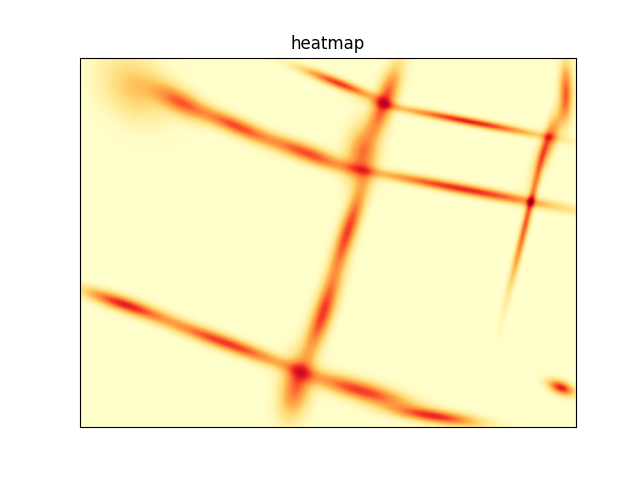

# roads_gmm

Detect roads in an aerial image and generate a Gaussian Mixture Model fitting them.

## Dependencies

 - tensorflow
 - patchify
 - tqdm
 - https://github.com/Vooban/Smoothly-Blend-Image-Patches
 - Dataset: https://www.kaggle.com/datasets/balraj98/deepglobe-road-extraction-dataset

## Example application

 1. Take an aerial image as input
 []
 2. Use a trained model to extract roads
 []
 3. Fit a GMM to the detected roads. 
 []